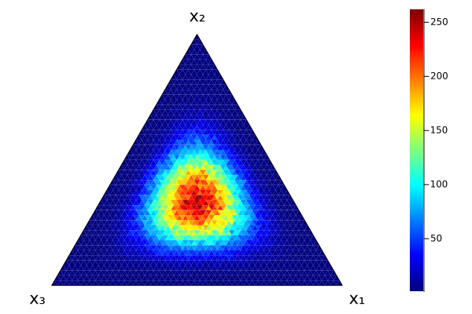

# SimplexPlots

[](https://github.com/hkauhanen/SimplexPlots.jl/actions/workflows/CI.yml?query=branch%3Amain)


## What is it?

SimplexPlots.jl is a [Julia](https://julialang.org) package for plotting simple [simplex plots](https://en.wikipedia.org/wiki/Ternary_plot) (also known as ternary plots, Gibbs triangles or de Finetti diagrams depending on your field).

Other Julia packages that do this, with certain differences, are [TernaryDiagrams.jl](https://github.com/stelmo/TernaryDiagrams.jl) and [TernaryPlots.jl](https://github.com/jacobusmmsmit/TernaryPlots.jl).


## How to install it?

```julia
]add https://github.com/hkauhanen/SimplexPlots.jl
```

## How to use it?

See the [Documentation](https://hkauhanen.github.io/SimplexPlots.jl).

A quick example:

```julia
using Plots, SimplexPlots, Distributions

dir = Dirichlet(5 .* ones(3))

simplex_histogram(rand(dir, 100_000))
```




