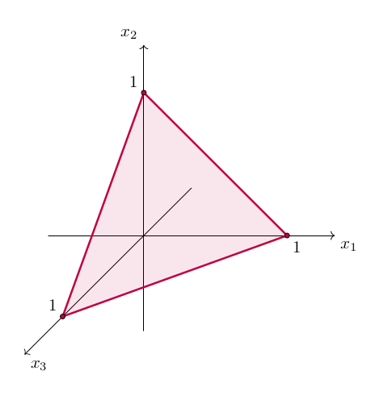
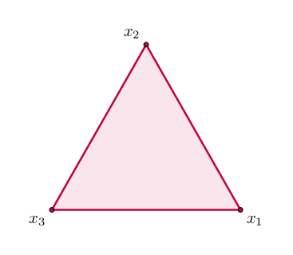

# Guide

```@setup g
using Random
Random.seed!(123)
```


## Introduction

Mathematically, the ``(n-1)``-dimensional simplex is the subset of ``\mathbb{R}^n`` whose points ``\mathbf{x} = (x_1, \ldots , x_n)`` satisfy the following conditions:

1. ``x_i \geq 0`` for all ``i = 1, \ldots , n``
1. ``\sum_{i=1}^n x_i = 1``

In the $n=3$ case, this set looks as follows:



Since the simplex itself is a two-dimensional structure in this case, we can "lift" it out of the three-dimensional Euclidean space and visualize it in the plane:



Each vertex of this triangle corresponds to one of the standard basis vectors of ``\mathbb{R}^3``, i.e. $x_i = 1$ for some $i$ (and, by implication, $x_j = 0$ for all $j \neq i$). The point in the middle is the *maximum-entropy state* or *barycentre* ``(1/3, 1/3, 1/3)``.

One may equivalently think of the simplex as the set of all possible categorical probability distributions over ``n`` options, such that ``x_i`` gives the probability of the ``i``th option.


## Installation and usage

To install SimplexPlots.jl:

```julia
]add https://github.com/hkauhanen/SimplexPlots.jl
```

To load it:

```@example g
using Plots
using SimplexPlots
```

!!! warning

    SimplexPlots.jl does not import routines defined in Plots.jl. In practical terms, this means that if you wish to make use of functionality provided by the latter (such as saving figures into files) you will need to be `using` both packages, as above.


## Scatterplots and lineplots

The functions `simplex_scatter` and `simplex_plot` accept a column vector, a row vector, a matrix, or a vector of column vectors as input:

```@example g
myvector = [0.1, 0.1, 0.8]

simplex_scatter(myvector)

savefig("scatter1.png") # hide
nothing # hide
```


```@example g
myvector = [0.1 0.1 0.8]

simplex_scatter(myvector)

savefig("scatter1b.png") # hide
nothing # hide
```


```@example g
mymatrix = [0.1 0.1 0.8
            0.1 0.8 0.1
            0.8 0.1 0.1]

simplex_scatter(mymatrix)

savefig("scatter2.png") # hide
nothing # hide
```


```@example g
myvecs = [[0.1, 0.1, 0.8], [0.1, 0.8, 0.1], [0.8, 0.1, 0.1]]

simplex_scatter(myvecs)

savefig("scatter2b.png") # hide
nothing # hide
```


!!! note

    This multitude of input formats is deliberate, as it allows the output of many
    kinds of data-generating routines to be fed directly into SimplexPlots.jl.
    We will see examples of this throughout the Guide.

    Internally, all input types are transformed into a matrix of three columns
    before plotting.


These functions accept the arguments accepted by Plots.jl's `plot` and `scatter`. For instance:

```@example g
mymatrix = [0.1 0.1 0.8
            0.3 0.4 0.3
            0.2 0.6 0.2
            0.1 0.7 0.2
            0.0 0.8 0.2
            0.0 1.0 0.0]

simplex_plot(mymatrix; label=nothing, linewidth=4.0, color=:blue)

savefig("scatter3.png") # hide
nothing # hide
```


Furthermore, a `vertices` keyword argument is provided which sets the labels on the vertices of the simplex. For instance:

```@example g
using LaTeXStrings

mymatrix = [0.1 0.1 0.8
            0.3 0.4 0.3
            0.2 0.6 0.2
            0.1 0.7 0.2
            0.0 0.8 0.2
            0.0 1.0 0.0]

simplex_plot(mymatrix; label=nothing, linewidth=4.0, color=:blue,
                       vertices = [L"x_1", L"x_2", L"x_3"])

savefig("scatter4.png") # hide
nothing # hide
```


For a more interesting example, let's plot the solution of a dynamical system.

```@example g
# we will use DifferentialEquations.jl to obtain the solution
# (see https://docs.sciml.ai/DiffEqDocs/stable/getting_started/)
using DifferentialEquations
using LinearAlgebra

# the replicator dynamic (see https://en.wikipedia.org/wiki/Replicator_equation)
replicator(u, A, t) = u .* (A*u .- transpose(u)*A*u)

# rock-paper-scissors payoff matrix
RPS = [ 0  -1   1
        1   0  -1
       -1   1   0 ]

# set up the problem
u0 = [0.2, 0.2, 0.6]
tspan = (0.0, 15.0)
prob = ODEProblem(replicator, u0, tspan, RPS)

# obtain solution
sol = solve(prob, saveat=0.1)

# plot solution
simplex_plot(sol.u; 
             vertices = [L"u_1", L"u_2", L"u_3"],
             color = :black,
             linewidth = 3.0,
             title = "Rock-Paper-Scissors in Replicator Dynamics",
             label = nothing)

savefig("solution.png") # hide
nothing # hide
```


## Histograms

To illustrate the plotting of histograms, we will create a [Dirichlet distribution](https://en.wikipedia.org/wiki/Dirichlet_distribution) and sample random variates from it. Here is the definition of the distribution:

```@example g
using Distributions

dir = Dirichlet(5 .* ones(3))
```

Random variates can be obtained using the `rand` function. To obtain, say, 10,000 random vectors, we call:

```@example g
some_random_vectors = rand(dir, 10_000)
```

These can be passed to `simplex_histogram` to obtain a histogram:

```@example g
simplex_histogram(some_random_vectors)

savefig("histo1.png") # hide
nothing # hide
```


Adding more random vectors gives us a smoother picture of the underlying distribution:

```@example g
simplex_histogram(rand(dir, 100_000))

savefig("histo2.png") # hide
nothing # hide
```


The `bins` keyword argument can be used to control the number of triangular histogram bins:

```@example g
simplex_histogram(rand(dir, 100_000); bins=10)

savefig("histo3.png") # hide
nothing # hide
```


```@example g
simplex_histogram(rand(dir, 1_000_000); bins=100)

savefig("histo4.png") # hide
nothing # hide
```


!!! note

    Technically, `bins` is not the number of bins in the simplex, but rather 
    the "resolution" along any of its three sides.)

!!! warning

    Expect long execution times when the number of bins is large!

The `vertices` and `color` arguments can be used to change the labelling of the vertices and the color gradient:

```@example g
using LaTeXStrings

simplex_histogram(rand(dir, 10_000);
                  bins=20,
                  vertices = [L"\xi_1", L"\xi_2", L"\xi_3"],
                  color = :Pastel1_3)

savefig("histo5.png") # hide
nothing # hide
```


## Heatmaps

For heatmaps, two plotting strategies are provided. By default, the function `simplex_heatmap` will fill the triangle with small squares. This is very fast but looks dreadful if the resolution of the heatmap is low, i.e. if there are not very many squares. The other option is to fill the simplex with little triangles, much like the histogramming function does. This tends to produce more visually pleasing results, especially when resolution is low, but is very slow to execute as resolution grows.

To illustrate these differences, we will plot the pdf (probability density function) of the Dirichlet distribution `dir` created above, at different resolutions, using the two methods.

First, the "fast" square method:

```@example g
resolution = 0.1
mysequence = 0.0:resolution:1.0

grid = [pdf(dir, [x, y, 1-x-y]) for x in mysequence, y in mysequence]

simplex_heatmap(grid)

savefig("heat1.png") # hide
nothing # hide
```


Obviously, filling the triangle with squares is difficult if the squares are too large... However, with higher resolutions this works well:

```@example g
resolution = 0.001
mysequence = 0.0:resolution:1.0

grid = [pdf(dir, [x, y, 1-x-y]) for x in mysequence, y in mysequence]

simplex_heatmap(grid)

savefig("heat2.png") # hide
nothing # hide
```


By contrast, here is the result when using the slower triangle method. To use this, specify the `method = "triangle"` keyword argument:

```@example g
resolution = 0.02
mysequence = 0.0:resolution:1.0

grid = [pdf(dir, [x, y, 1-x-y]) for x in mysequence, y in mysequence]

simplex_heatmap(grid; method = "triangle")

savefig("heat3.png") # hide
nothing # hide
```


!!! danger

    The `method = "triangle"` option is experimental. Expect, certainly, long
    execution times if the heatmap resolution is large, and, possibly, illogical
    behaviour.


## Adding to plots

SimplexPlots.jl also provides exclamation-marked versions of `simplex_plot` and `simplex_scatter`. This means you can add content to an already existing plot. This way we can combine, for instance, the solution of the Rock-Paper-Scissors dynamics and one of the histograms from above:

```@example g
simplex_histogram(rand(dir, 10_000);
                  bins=20,
                  vertices = [L"u_1", L"u_2", L"u_3"],
                  color = :Pastel1_3)

simplex_plot!(sol.u; 
              color = :black,
              linewidth = 3.0,
              label = nothing)

savefig("combo.png") # hide
nothing # hide
```


Or we can illustrate several solutions of rock-paper-scissors in a single plot:

```@example g
u0 = [0.1, 0.1, 0.8]
prob1 = ODEProblem(replicator, u0, tspan, RPS)

u0 = [0.2, 0.2, 0.6]
prob2 = ODEProblem(replicator, u0, tspan, RPS)

u0 = [0.3, 0.3, 0.4]
prob3 = ODEProblem(replicator, u0, tspan, RPS)

sol1 = solve(prob1, saveat=0.1)
sol2 = solve(prob2, saveat=0.1)
sol3 = solve(prob3, saveat=0.1)

simplex_plot(sol1.u; 
             vertices = [L"u_1", L"u_2", L"u_3"],
             color = :red,
             linewidth = 3.0,
             label = "solution 1")

simplex_plot!(sol2.u;
              color = :green,
              linewidth = 3.0,
              label = "solution 2")

simplex_plot!(sol3.u;
              color = :blue,
              linewidth = 3.0,
              label = "solution 3")

savefig("solutions.png") # hide
nothing # hide
```


# Axis orientation

The vertices of the simplex are labelled using the strings in the `vertices` keyword argument. By default, this is done counter-clockwise starting from the rightmost vertex. To control this order, each SimplexPlots.jl method -- with the exception of `simplex_heatmap` -- accepts an `axes` keyword argument which specifies the axis order, the default being `axes = [1, 2, 3]`. Witness:

```@example g
mymatrix = [0.1 0.1 0.8
            0.3 0.4 0.3
            0.2 0.6 0.2
            0.1 0.7 0.2
            0.0 0.8 0.2
            0.0 1.0 0.0]

simplex_plot(mymatrix; label=nothing, linewidth=4.0, color=:blue, axes = [1, 2, 3])

savefig("axes1.png") # hide
nothing # hide
```


```@example g
simplex_plot(mymatrix; label=nothing, linewidth=4.0, color=:blue, axes = [2, 1, 3])

savefig("axes2.png") # hide
nothing # hide
```


```@example g
simplex_plot(mymatrix; label=nothing, linewidth=4.0, color=:blue, axes = [3, 1, 2])

savefig("axes3.png") # hide
nothing # hide
```


!!! warning

    Changing the vertex labels does not reorder the axes. Only specifying the `axes`
    keyword argument does so!

With heatmaps, currently the only way of changing the axes is by modifying the input itself, along with the requisite modification to the `vertices` argument. For instance:

```@example g
dir = Dirichlet([9.0, 6.0, 3.0])

resolution = 0.001
mysequence = 0.0:resolution:1.0

grid1 = [pdf(dir, [x, y, 1-x-y]) for x in mysequence, y in mysequence]

simplex_heatmap(grid1; vertices = ["x", "y", "z"])

savefig("heataxes1.png") # hide
nothing # hide
```


```@example g
grid2 = [pdf(dir, [y, x, 1-x-y]) for x in mysequence, y in mysequence]

simplex_heatmap(grid2; vertices = ["y", "x", "z"])

savefig("heataxes2.png") # hide
nothing # hide
```


```@example g
grid3 = [pdf(dir, [1-y-z, y, z]) for z in mysequence, y in mysequence]

simplex_heatmap(grid3; vertices = ["z", "y", "x"])

savefig("heataxes3.png") # hide
nothing # hide
```


This is likely to change in a future version.


